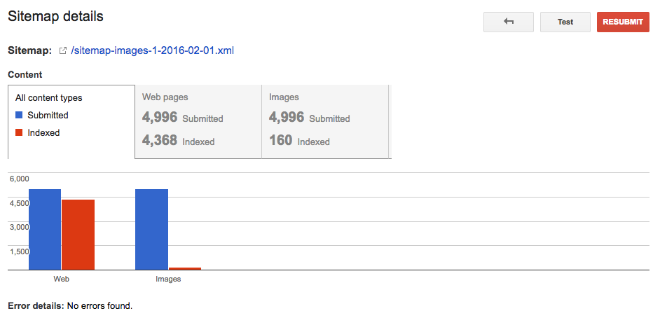
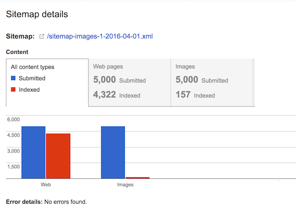

## Barium-Ion

A controlled experiment for Google Image Search. [Barium ion is the smallest particle you can actually "see".](http://physics.stackexchange.com/questions/104523/which-is-the-smallest-known-particle-that-scientists-have-actually-seen-with-th)

### Rename Image Files for a Single Sitemap

We experiment with [sitemap-images-1-2016-02-01.xml](https://www.artsy.net/sitemap-images-1-2016-02-01.xml). Beginning indexing state [160/4996 images indexed](https://www.google.com/webmasters/tools/sitemap-details?hl=en&siteUrl=https%3A%2F%2Fwww.artsy.net%2F&sitemapUrl=https%3A%2F%2Fwww.artsy.net%2Fsitemap-images-1-2016-02-01.xml). There're 4257/4996 published artworks in this sitemap.



The control group is [sitemap-images-1-2016-04-01.xml](https://www.artsy.net/sitemap-images-1-2016-04-01.xml). Beginning indexing state [157/5000 images indexed](https://www.google.com/webmasters/tools/sitemap-details?hl=en&siteUrl=https%3A%2F%2Fwww.artsy.net%2F&sitemapUrl=https%3A%2F%2Fwww.artsy.net%2Fsitemap-images-1-2016-04-01.xml). There're 4300/5000 published artworks in this sitemap.



#### Get Published Artwork Info

```
AWS_ID=... AWS_SECRET=... rake ow:config:from_env[production] sitemap:info[sitemaps/sitemap-images-1-2016-02-01/sitemap-images-1-2016-02-01.xml]
```

Will output the number of published vs. unpublished artworks.

#### Generate Slugged Files

```
AWS_ID=... AWS_SECRET=... rake sitemap:copy[sitemaps/sitemap-images-1-2016-02-01/sitemap-images-1-2016-02-01.xml]
```

This copies files from their generic name (eg. `u56wVaBVFOMFQrtf1tGOhw/larger.jpg`) to their sluggled name (eg. `u56wVaBVFOMFQrtf1tGOhw/christian-de-laubadere-lu-mi-the-murmur-of-pines-number-7.jpg`).

#### Set Slugged URLs

```
AWS_ID=... AWS_SECRET=... rake ow:config:from_env[production] sitemap:update[sitemaps/sitemap-images-1-2016-02-01/sitemap-images-1-2016-02-01.xml]
```

This replaces the URL for either `larger` or `large` versions (depending on the value in the sitemap) to the slugged JPG.

#### Invalidate Caches

Gravity caches are invalidated by hand by copy-pasting IDs into the console.

Get the `reflection:artworks:invalidate` Rake task from [github.com/dblock/gravity#barium-ion-reflection-invalidate](https://github.com/dblock/gravity/tree/barium-ion-reflection-invalidate). Run the invalidate task using an output file.

```
RAILS_ENV=production rake ow:config:from_env reflection:artworks:invalidate[../sitemap-images-1-2016-02-01-update.json]
```

Update sitemaps in [fusion](https://github.com/artsy/fusion). This fetches everything from Gravity in increments.

```
heroku run npm run scrape --app=fusion-production
```
